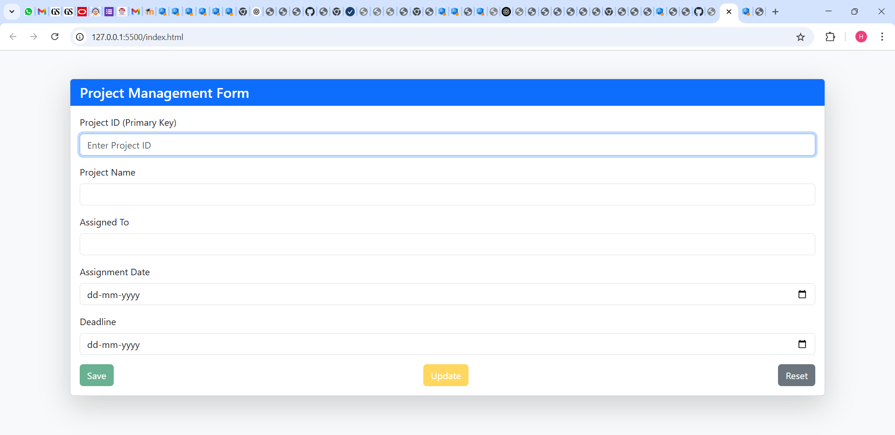
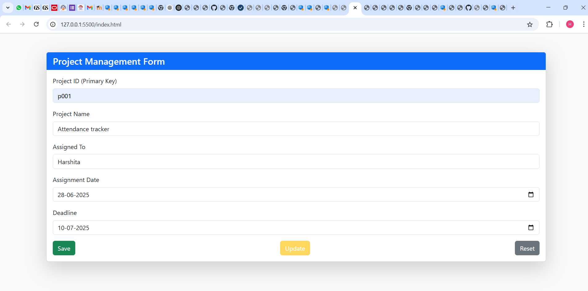
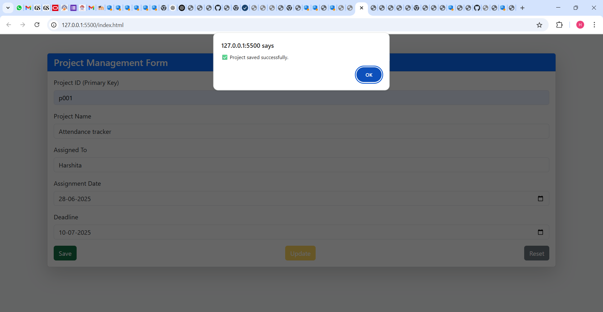
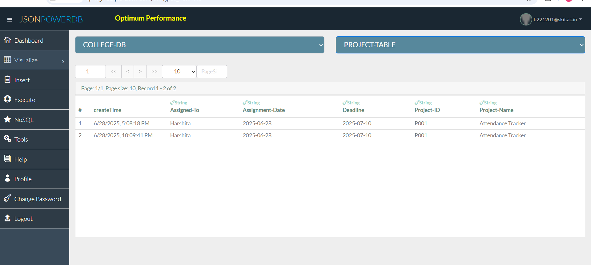

# 📋 Project Management Form using JsonPowerDB (JPDB)

This is a simple, dynamic web form that lets users manage project details like **Project ID**, **Assignment Date**, and **Deadline** — and stores that data using **JsonPowerDB**, a NoSQL, REST-based database platform by **[Login2Explore](https://login2explore.com)**.

---

## 🚀 Features

✅ Add a new project (with unique Project ID)  
🔄 Update an existing project  
🔃 Reset the form  
📦 Connects to JPDB via REST API  
🌐 Uses proxy to bypass CORS for browser testing  

---

## 🖥️ Tech Stack

💻 HTML & Bootstrap 5 (for layout and styling)  
🧠 Vanilla JavaScript  
🔗 JsonPowerDB (JPDB) from [Login2Explore](https://login2explore.com)  
🌐 CORS Proxy (for local frontend fetch testing)  

---

## ✅ Benefits of using JsonPowerDB

- 🔌 **Simple REST API interface** to connect with database
- ⚡ **High performance** NoSQL engine with ultra-fast CRUD operations
- 🔐 **Token-based access** without session management
- 💡 **Schema-free design** makes it easy to prototype
- 🔄 Easy integration with **AJAX, jQuery, JavaScript**
- 📦 Ideal for building **lightweight single-page apps** (SPA)

📚 More on JPDB: [https://login2explore.com/jpdbdocs.html](https://login2explore.com/jpdbdocs.html)

---

## 🛠️ Scope of Functionalities

- 📥 Add a new project (with unique Project ID)
- ✏️ Update existing project details
- 🗑️ Reset form fields
- 🔗 Store and retrieve data from JPDB
- 🧪 Uses proxy to overcome browser CORS limitations

---

## 🖼️ Illustrations

### 1. Initial Form (empty)

### 2. Form Filled

### 3. Save Success

### 4. Data in JPDB

## 🙌 Acknowledgements

🧠 Backend powered by [Login2Explore](https://login2explore.com)  
🔧 Proxy used: [CORS Anywhere](https://cors-anywhere.herokuapp.com)  
💻 Built by: **Harshita Ahuja**  

---

